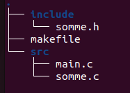

## Makefile Description

The `Makefile` is used to automate the process of building and cleaning the project in main (isrc/)that include a function called sum that defined in src/  and the directory of it prototype is located in include/

### Variables:
- `TARGET = prog`: The name of the executable file
- `CC = gcc`: the use of gnu compiler collection for the compilation of program.
- `CFLAGS = -Wall -Wextra -Iinclude`: options for the compiler that includes warnings and specify the directory of somme library
- `SRC = src/somme.c src/main.c`: source files
- `OBJ = somme.o main.o`: object files geberated by the compiler 

## Directory Structure

- `src/`: Contains the source files (`main.c`, `somme.c`).
- `include/`: Contains header files (`somme.h`).
- `prog`: The compiled executable.
- `makefile`: The build script for the project.

## How to Build

1. Clone the repository.
2. Run `make` to build the project using the `Makefile`.
3. Run `./prog` or type `make all` to execute the program. 

## How to Clean

Run `make clean` to remove the object files and executable.

